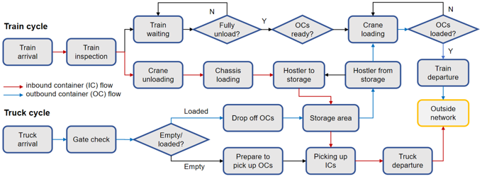

# LIFTS
Line-Haul Intermodal Freight Terminal Simulation (LIFTS) is a SimPy-based simulation framework.

## Project Framework
- **demo.py**: 
  - The highest-level script that manages the entire simulation. 
  - It takes input data such as simulation length, resource combinations, etc., and handles the orchestration of the simulation process.
  - Run this file for large scale test.

- **main.py**: 
  - This file is responsible for executing a single simulation based on the input data. It reads configuration details from the `input/sim_config.json` file, which includes parameters like resource requirements, processing times, and distances.
  - It includes:
    - **distance.py**: Supports vehicle distance estimation based on the optimal layout model. This file plays a key role in calculating distances required for simulating vehicle movements within the terminal.
    - **parameters.py**: Defines operational performance data for each process in the simulation, such as resource usage, processing times, and system efficiency. See `Model Operation Logic` for more details.
    - **vehicle.py**: Defines the vehicle speed based on speed-density functions derived from AnyLogic simulations for intermodal terminals.

- **input**:  
  - **`input/sim_config.json`**: 
    Contains the input data for the simulation configuration, including distance calculations and operational parameters. The `sim_config.json` helps to define the core configuration for the simulation.
  - **`input/layout.xlsx`**: 
    Layout data that is determined by demand, given the train batch size. This file helps define how the terminal layout is configured to handle incoming and outgoing containers efficiently.
  - **`input/resources.xlsx`**: 
    Contains the percentage distribution of diesel and electric vehicles, providing insights into the resource mix for the simulation.
  - **`input/train_timetable.json`**: 
    The train timetable is derived from a uniform distribution and defines the arrival and departure schedules of trains in the simulation. This data is crucial for simulating train operations.

- **output**:
  - **`output`**
    Running `main.py` will generate the results, which will be saved in an Excel file located here.
  - **`demos/single_track_results`**:
    Running `demo.py` will generate multiple Excel files with various combinations, which can be found here. 

## Model Operation Logic
 

## Model Assumptions
1. Single-track operation is simulated.
2. Process one train at a time.
3. Numbers of OCs and ICs are equal.
4. Each container follows the same operational logic (right plot).
5. OCs for the upcoming train are fully prepared before hostlers begin pickup.
6. Each railcar carries one container only.
7. Each chassis holds a single container, with no stacking.
8. All vehicles are assumed to have sufficient diesel for every assigned trip.
9. Dwell time is not constrained by train charging.

## Environment Setting
Start with the base environment, then run pip install `simpy==4.1.1`, and refer to the `requirements.txt` for additional packages.
